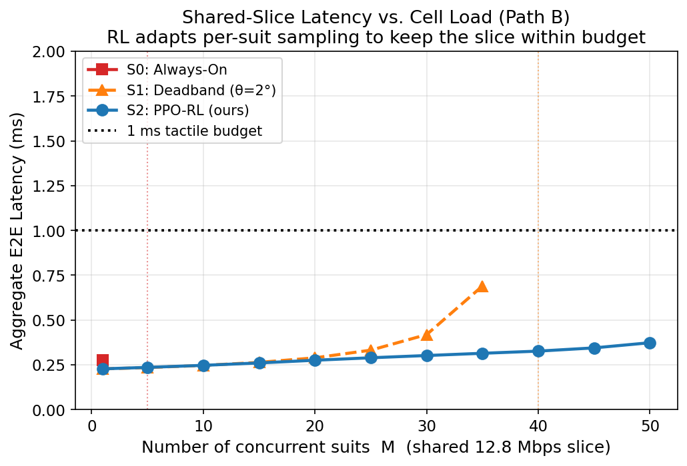

# Channel-Aware Reinforcement Learning for Multi-User 6G Tactile-Internet Telepresence

> A learned, congestion-aware sampling policy that lets **one shared 6G URLLC slice carry up to 75 concurrent telepresence suits within the 1 ms tactile latency budget** — about **2× more than a fixed perceptual deadband** and **~37× more than always-on streaming** — while keeping motion reconstruction within human perceptual limits.

---

## Motivation

The tactile Internet over 6G targets a **1 ms end-to-end latency** for telepresence and teleoperation. A telepresence suit streams tens of joint angles (body + hand) at sensor frame rate — a few thousand messages per second per suit. One suit barely loads the network, but a **cell of many suits** does: as more suits become active, the aggregate traffic saturates the shared radio slice, the queueing delay grows super-linearly, and the 1 ms budget collapses **for everyone**.

The classical remedy is the **perceptual deadband** (Hinterseer & Steinbach, 2008): suppress joint updates smaller than the just-noticeable-difference (JND). But a fixed deadband is **blind to the channel** — under congestion every suit keeps transmitting at the same rate and the slice overloads.

**This project makes the sampling policy channel-aware.** A reinforcement-learning agent (PPO) decides, per joint and per frame, whether to transmit — conditioning on both the joint kinematics **and the current cell congestion**. As the cell fills, each suit gracefully reduces its own rate (trading a little fidelity, kept within JND where possible) so the shared slice stays within budget.

## Headline results

| Policy | Per-suit rate | **Max suits within 1 ms** | vs. always-on |
|---|---|---|---|
| **S0** — Always-On | 3540 msg/s (fixed) | **2** | ×1 |
| **S1** — Perceptual Deadband | 201 msg/s (fixed) | **36** | ×18 |
| **S2** — Channel-Aware RL (ours) | 234 → 96 msg/s (adaptive) | **75** | **×37** |



*The RL policy keeps the shared slice within the 1 ms budget far beyond the fixed deadband by adapting each suit's rate to congestion.*

Additional findings:

- **Graceful degradation.** Per-suit reconstruction error rises with congestion but stays **below the JND** (2° body, 3° hand) up to ~50 suits — fidelity is traded for latency only when the cell demands it.
- **Channel awareness is the cause of the gain.** An ablation that hides the congestion/latency inputs collapses the policy to a constant-rate sampler (ceiling **50** suits); the channel-aware policy reaches **75**. The **+25-suit** gain is attributable purely to channel awareness.
- **Statistically significant.** At M = 40 (where the deadband already overloads), the RL policy cuts per-suit rate from 201 to 123 msg/s (paired Wilcoxon **p = 1.8×10⁻¹²**), staying within JND.
- **Validated queue model.** The analytic M/D/1 latency matches a discrete-event simulation to within **0.33%**.
- **Closed-form capacity bound.** `M*(r) = ρ*·C / r` (here ρ* = 0.925, C = 8000 msg/s ⇒ M*(r) = 7403 / r).
- **Cross-stream transfer.** A policy trained on body traces transfers to the hand stream with no measurable loss vs. a jointly trained policy.

## Method in one paragraph

Per-joint sampling is cast as a Markov decision process. The state contains the angular deviation since last send, velocity, acceleration, time-since-send, an error estimate, the **network-signalled congestion** (number of competing suits), the **realized latency headroom**, and a motion-phase flag. The action is binary (send/skip). The reward penalizes traffic, JND violations, and 1 ms-budget violations. A single PPO policy (shared by all suits, which makes the mean-field channel coupling exact) is trained with domain randomization over the number of suits.

## Repository layout

```
src/
  loaders/        # DIP-IMU (body) and NinaPro DB9 (hand) dataset loaders
  network/        # M/D/1 shared-slice latency model
  agent/          # Gymnasium env + PPO training (env.py, train.py, train_mix.py)
  metrics/        # metrics collection
  common/         # MQTT message schema
experiments/
  run_experiment.py   # S0 / S1 / S2 evaluation sweep over number of suits M
  sim_validation.py   # discrete-event (SimPy) validation of the M/D/1 model
analysis/
  plot_results.py     # figures (latency, graceful degradation, rate vs M)
  feasibility.py      # feasibility-bound analysis + figure
results/
  logs/           # JSON result files behind the figures
  figures/        # generated figures (PNG)
models/
  ppo_s2_B.zip        # trained channel-aware policy
  ppo_s2_blind.zip    # ablated (channel-blind) policy
docs/
  architecture.png / .drawio   # system architecture diagram
```

## Datasets

The two public motion-capture datasets are **not** redistributed here. Download them and place the angle data under `data/raw/`:

- **DIP-IMU** (body, 24 joints @ 60 Hz, SMPL ground truth): https://dip.is.tue.mpg.de/
- **NinaPro DB9** (hand, CyberGlove-II, 21 valid sensors @ 100 Hz): http://ninapro.hevs.ch/

See the loader modules for the expected directory structure.

## Quick start

```bash
python -m venv venv && source venv/bin/activate
pip install -r requirements.txt

# Train the channel-aware policy (PPO; ~2 min on CPU)
python src/agent/train.py --subjects s_01 s_02 --steps 600000 --out ppo_s2_B

# Evaluate S0 / S1 / S2 at a given number of suits M
python experiments/run_experiment.py --scenario s2 --M 40 --model models/ppo_s2_B.zip

# Validate the latency model against a discrete-event simulation
python experiments/sim_validation.py

# Regenerate the figures from the saved result logs
python analysis/plot_results.py
python analysis/feasibility.py
```

## Citation

If you use this work, please cite:

```
@inproceedings{belov2026tactile6g,
  title     = {Channel-Aware Reinforcement Learning for Perceptual Sampling
               in Multi-User Tactile-Internet Telepresence over 6G},
  author    = {Belov, Maksim and others},
  booktitle = {(to appear)},
  year      = {2026}
}
```

## License

Released under the MIT License — see [LICENSE](LICENSE).

---

*Developed at Meganetlab 6G, The Bonch-Bruevich Saint-Petersburg State University of Telecommunications (SPbGUT).*
